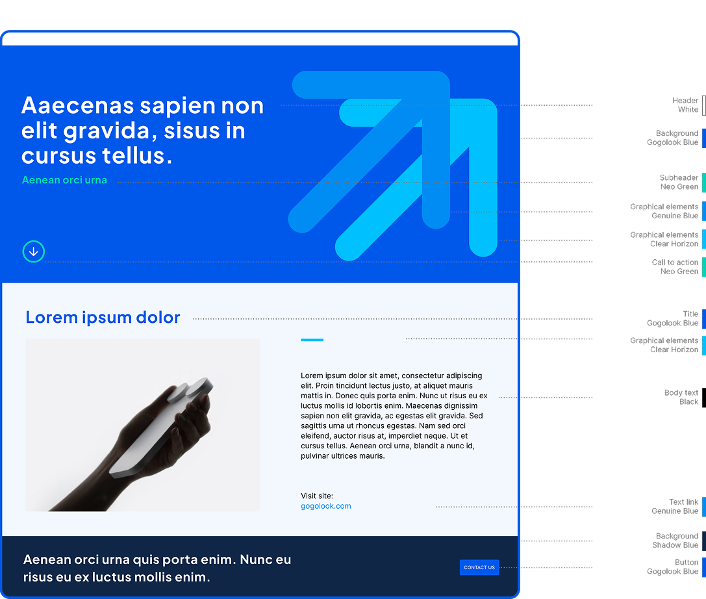

# Gogolook Brand Design Guidelines

The official brand design guidelines for Gogolook, a TrustTech company building trust and safety in communications worldwide. This single-page website documents the complete visual identity system including logo, colors, typography, layout, photography, and gradient rules.



## Quick Start

No build tools required. Open the file directly in a browser:

```bash
open index.html
```

Or serve locally:

```bash
python3 -m http.server 8000
# Visit http://localhost:8000
```

## Deployment

This site is deployed via **GitHub Pages** under the `gogolook-design` organization.

1. Push changes to the `main` branch
2. GitHub Pages automatically serves from the repository root
3. No build step is needed

The live site is available at the GitHub Pages URL configured for the `gogolook-design` organization.

## Folder Structure

```
├── index.html             Single-page brand guideline (all chapters)
├── assets/
│   ├── logo/              Logo SVGs, usage examples, evolution timeline, incorrect usage
│   ├── colors/            Color palette, gradients, usage proportions
│   ├── layout/            Grid systems (2/3/6-column), margin guides
│   └── photography/       Photography direction (lifestyle, environment, connected)
└── skills/                Downloadable Claude Code AI skill files
    ├── gogolook-brand-SKILL.md
    ├── gogolook-slides-SKILL.md
    └── gogolook-ui-SKILL.md
```

## Chapters

| #  | Chapter      | Description                                              |
|----|--------------|----------------------------------------------------------|
| 01 | Logo         | Evolution, preferred usage, monochrome, incorrect usage  |
| 02 | Colors       | Primary palette, supporting colors, usage proportions    |
| 03 | Typography   | Font families, weights, sizing scale                     |
| 04 | Layout       | Grid systems, margin rules                               |
| 05 | Photography  | Style direction, do/don't examples                       |
| 06 | Gradient     | Standard, duotone, freeform, usage guidelines            |
| 07 | AI Skills    | Downloadable SKILL.md files for Claude Code              |

## AI Skills

Chapter 07 provides three downloadable **SKILL.md** files designed for use with [Claude Code](https://docs.anthropic.com/en/docs/claude-code). Each skill encodes domain-specific brand knowledge that Claude can reference when generating on-brand content:

- **Gogolook Brand** -- Logo usage, color palette, typography, photography principles, and gradient rules for all Gogolook materials
- **Gogolook Slides** -- Presentation templates, slide layouts, and deck structure for Gogolook-branded decks and pitch materials
- **Gogolook UI** -- Full web design system with tokens, components, layout rules, and interaction patterns from gogolook.com

To use a skill, download the `.md` file and place it at `~/.claude/skills/` or in your project's `.claude/skills/` directory.

## Password Protection

The site uses a client-side password gate to limit casual access. The password overlay appears on page load and must be cleared before content is visible.

> **Note:** This is a lightweight deterrent for internal distribution, not a security measure. All content is present in the HTML source.

## Tech Stack

- Plain HTML with inline CSS
- No frameworks, no build tools, no npm
- Fonts via [Google Fonts](https://fonts.google.com/) (Plus Jakarta Sans, Inter, Noto Sans)
- Static assets (PNG, SVG) in the `assets/` directory

## License

Confidential -- Gogolook Co., Ltd. All rights reserved.

This brand guideline and its contents are proprietary to Gogolook. Unauthorized reproduction, distribution, or use of these materials is prohibited.
